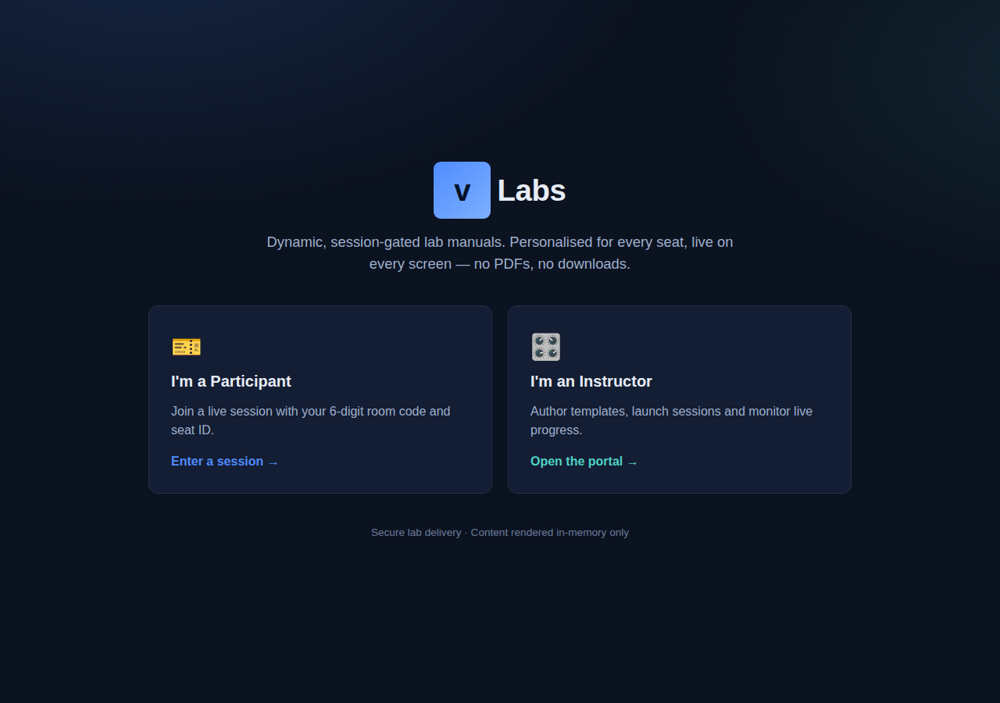

# vLabs — Dynamic Lab Manual Web Application

A secure, session-gated web application that replaces static, per-device PDF lab
manuals with a **dynamic templating engine** that personalises instructions for
every participant in real time.

Built to the *Dynamic Lab Manual Web Application* technical specification:
eliminate physical PDF provisioning, enforce strict IP protection (no
downloadable materials), and deliver per-seat instructions live to classroom
devices.

## Screenshots

| Participant lab (per-seat, gated) | Instructor session monitor |
| --- | --- |
|  |  |

| Template authoring + live preview | Landing |
| --- | --- |
|  |  |

---

## Table of contents

- [Highlights](#highlights)
- [Architecture](#architecture)
- [Tech stack](#tech-stack)
- [Quick start (local dev)](#quick-start-local-dev)
- [Running with Docker](#running-with-docker)
- [How it works](#how-it-works)
  - [The templating engine](#the-templating-engine)
  - [Progressive disclosure & checkpoints](#progressive-disclosure--checkpoints)
  - [Security & IP protection](#security--ip-protection)
- [Data model](#data-model)
- [API reference](#api-reference)
- [Configuration](#configuration)
- [Testing](#testing)
- [Deployment notes](#deployment-notes)
- [Project layout](#project-layout)

---

## Highlights

| Spec requirement | Where it lives |
| --- | --- |
| **Instructor Portal** — create sessions, generate 6-digit codes, monitor & terminate | `client/src/pages/Dashboard.jsx`, `SessionMonitor.jsx`; `server/src/routes/sessions.js` |
| **Participant Portal** — join by code + seat, view personalised steps | `client/src/pages/Join.jsx`, `Lab.jsx`; `server/src/routes/participant.js` |
| **Dynamic templating** — inject seat/IP/port variables at render time | `server/src/lib/templating.js` |
| **Structured cards** — Desk Action vs Computer Action | `client/src/components/StepCard.jsx` |
| **Collapsible hints** (`<HintBox>`) — progressive disclosure | `client/src/components/HintBox.jsx` |
| **State checkpoints** — validation string unlocks next step | `client/src/components/Checkpoint.jsx`; server-side validation |
| **Analytics** — real-time per-seat progress & time-on-step | `SessionMonitor.jsx`; `step_events` table |
| **Authoring environment** — Markdown editor with live per-seat preview | `client/src/pages/TemplateEditor.jsx` |
| **Zero data footprint** — DOM-only, no file downloads | no download endpoints; `no-store` headers; memory-only tokens |
| **Session gating** — time-limited PIN, instant revocation | `server/src/middleware/auth.js` |
| **Rate limiting & anti-scraping** | `server/src/middleware/rateLimit.js`; progressive content delivery |
| **Dockerization** | `Dockerfile`, `docker-compose.yml` |

## Architecture

Client–server model with a Single Page Application frontend and a RESTful JSON
API backend, exactly as specified.

```
┌──────────────────────────┐         HTTPS (JSON only)        ┌──────────────────────────┐
│  React SPA (Vite)        │  ───────────────────────────────▶│  Express REST API        │
│  • Participant lab view  │                                   │  • Auth (JWT)            │
│  • Instructor portal     │◀───────────────────────────────  │  • Templating engine     │
│  • In-memory rendering   │      rendered, per-seat steps     │  • Session gating        │
└──────────────────────────┘                                   │  • Rate limiting         │
                                                               └────────────┬─────────────┘
                                                                            │
                                                                   ┌────────▼─────────┐
                                                                   │  SQLite          │
                                                                   │  templates /     │
                                                                   │  sessions /      │
                                                                   │  participants    │
                                                                   └──────────────────┘
```

In production the Express server also serves the built SPA, so the whole
application ships as **one container** that drops onto a single VM on the
training-facility network (put an HTTPS reverse proxy in front).

## Tech stack

| Layer | Choice | Why |
| --- | --- | --- |
| Frontend | **React 18 + Vite** SPA (`react-router`) | Strong state management for live sessions; fast dynamic Markdown rendering |
| Backend | **Node.js + Express** | Lightweight token generation and JSON template serving |
| Database | **SQLite** (`better-sqlite3`) | Structured storage for templates, sessions and seats; zero external service |
| Auth | **JWT** (`jsonwebtoken`) + `bcryptjs` | Stateless tokens; live session re-check enables instant revocation |
| Security | `helmet`, `express-rate-limit`, CSP | Headers, rate limiting, anti-scraping |
| Markdown | `marked` + `DOMPurify` | Render + sanitise instructor content |
| Deploy | **Docker** (multi-stage) | Single-VM containerised deployment |

The stack matches the spec's suggested options (React SPA + Node/Express + SQLite).

## Quick start (local dev)

Requires **Node 20+**.

```bash
# 1. Backend  (terminal 1)
cd server
npm install
npm run dev            # http://localhost:4000  (seeds instructor + sample lab)

# 2. Frontend (terminal 2)
cd client
npm install
npm run dev            # http://localhost:5173  (proxies /api to :4000)
```

Open **http://localhost:5173**.

Default instructor credentials (created on first run, override via env):

```
username: instructor
password: labmanual123
```

Try it end-to-end:

1. Sign in to the instructor portal → **Launch a session** from the seeded
   *Network Bench Setup* template. A 6-digit room code appears.
2. In another tab/device, open **Join**, enter the code and a seat number
   (e.g. `7`).
3. The lab renders personalised for that seat (gateway `192.168.1.107`, host
   `10.0.0.107`, port `7`…). Expand hints, clear the checkpoint to unlock the
   final step.
4. Back in the instructor **session monitor**, watch the seat's live progress
   and time-on-step; **End session** to revoke access instantly.

## Running with Docker

The whole app (SPA + API + SQLite) builds into a single image.

```bash
# Set secrets first (see .env.example), then:
docker compose up --build     # http://localhost:4000
```

Or with plain Docker:

```bash
docker build -t vlabs:latest .
docker run -p 4000:4000 \
  -e JWT_INSTRUCTOR_SECRET="$(openssl rand -hex 48)" \
  -e JWT_PARTICIPANT_SECRET="$(openssl rand -hex 48)" \
  -v vlabs-data:/app/server/data \
  vlabs:latest
```

> **Note on this repo's CI/sandbox:** the image was not built inside the
> authoring sandbox because its egress policy blocks Docker Hub base-image
> pulls. The Dockerfile is a standard multi-stage build and the exact runtime
> command (`NODE_ENV=production node server/src/index.js` serving `client/dist`)
> is verified end-to-end outside the container.

## How it works

### The templating engine

Instead of maintaining 20 separate manuals, one **master template** is stored as
structured JSON steps containing mustache-style placeholders. Variables are
resolved **per seat** at render time.

Instructors author variable **formulas** (not code). For example:

| Variable | Expression | Seat 7 → |
| --- | --- | --- |
| `PORT_NUM` | `seat` | `7` |
| `GATEWAY_IP` | `'192.168.1.' + (100 + seat)` | `192.168.1.107` |
| `HOST_IP` | `'10.0.0.' + (100 + seat)` | `10.0.0.107` |
| `VLAN` | `10 + seat` | `17` |

A step body then reads:

```markdown
Connect your patch cable to **Port {{ PORT_NUM }}**, then ping the gateway at
**{{ GATEWAY_IP }}**.
```

…and seat 7 receives *“Port 7 … ping the gateway at 192.168.1.107”*.

**Formulas are never `eval`'d.** `server/src/lib/templating.js` contains a small
hand-written recursive-descent evaluator that only understands numbers, quoted
strings, a fixed set of identifiers (`seat` plus earlier variables), arithmetic
operators and parentheses. Instructor content is fully sandboxed — even
`__proto__` is rejected as an unknown variable (covered by tests).

### Progressive disclosure & checkpoints

- **Hints** (`<HintBox>`) hide answers behind a click to encourage critical
  thinking.
- **Checkpoints** require the participant to enter a validation string (e.g. the
  value they discovered) to unlock the next page of instructions.

Checkpoints are enforced **server-side**: the server only ever sends the steps a
seat has legitimately reached, and the expected answer is stripped from every
payload. Submissions are validated against the per-seat expected value. This
doubles as the anti-scraping mechanism — locked steps and answers simply never
reach the browser.

### Security & IP protection

| Requirement | Implementation |
| --- | --- |
| **Zero data footprint** | Content is delivered as JSON to the DOM only. No PDF/DOCX/file endpoints exist. Rendered content is served with `Cache-Control: no-store`. Participant tokens live in memory (React state), never `localStorage`/disk — a refresh drops the seat back to the join screen. |
| **Session gating** | Access requires a time-limited 6-digit PIN. Every participant request re-validates the live session (`is_active` + `expires_at`), so a token is rejected the instant an instructor terminates or the session expires — no token blocklist needed. |
| **Anti-scraping / rate limiting** | Layered `express-rate-limit` (join brute-force, checkpoint guessing, content pull, login). Progressive content delivery caps what any seat can pull. |
| **Transport** | Designed to run behind mandatory HTTPS/TLS (reverse proxy). Strict `helmet` CSP, `noindex`. |
| **Client deterrents** | The lab view disables copy / context-menu / drag / save & print shortcuts and text selection. These are deterrents layered on top of the real server-side guarantees. |
| **Credentials** | Instructor passwords hashed with bcrypt; separate JWT secrets for instructor vs participant audiences. |

## Data model

SQLite tables (`server/src/db/index.js`):

- **`instructors`** — `id`, `username`, `password_hash`.
- **`templates`** — `id`, `title`, `description`, `content` (JSON steps with
  `{{placeholders}}`), `variables` (JSON formulas), `version`.
- **`sessions`** — `id`, `room_code` (6-digit), `title`, `template_id` (FK),
  `template_version`, `is_active`, `expires_at`. A partial unique index keeps
  one active session per room code while freeing terminated codes for reuse.
- **`participants`** — one seat per `(session_id, seat_id)`: `current_step`,
  `unlocked_step`, `completed_checkpoints`, `step_entered_at`, `last_seen_at`.
- **`step_events`** — append-only per-step timing log powering analytics.

## API reference

All responses are JSON. Instructor routes require `Authorization: Bearer
<instructor-token>`; participant routes require a participant token.

### Auth
| Method | Path | Description |
| --- | --- | --- |
| `POST` | `/api/auth/login` | Instructor login → token |
| `GET`  | `/api/auth/me` | Current instructor |

### Templates (instructor)
| Method | Path | Description |
| --- | --- | --- |
| `GET` | `/api/templates` | List templates |
| `GET` | `/api/templates/:id` | Get one |
| `POST` | `/api/templates` | Create |
| `PUT` | `/api/templates/:id` | Update (bumps version) |
| `DELETE` | `/api/templates/:id` | Delete (blocked if active sessions) |
| `POST` | `/api/templates/:id/preview` | Render for a seat (accepts an unsaved `draft`) |

### Sessions (instructor)
| Method | Path | Description |
| --- | --- | --- |
| `POST` | `/api/sessions` | Create session → 6-digit code |
| `GET` | `/api/sessions` | List sessions with live counts |
| `GET` | `/api/sessions/:id` | Detail + analytics (per-seat progress, step distribution) |
| `POST` | `/api/sessions/:id/terminate` | End now (instant revocation) |
| `POST` | `/api/sessions/:id/extend` | Push back expiry |

### Participant
| Method | Path | Description |
| --- | --- | --- |
| `POST` | `/api/participant/join` | Join by `room_code` + `seat_id` → participant token |
| `GET` | `/api/participant/steps` | Unlocked, per-seat rendered steps |
| `POST` | `/api/participant/checkpoint` | Submit unlock string (validated server-side) |
| `POST` | `/api/participant/progress` | Report active step (analytics) |
| `POST` | `/api/participant/heartbeat` | Presence keep-alive |

### Health
`GET /api/health` — unauthenticated liveness probe.

## Configuration

Copy `.env.example` → `.env` (server reads it via `dotenv`). Everything has a
safe dev default, so the app boots with no config; **set the secrets before any
real deployment**.

| Variable | Default | Purpose |
| --- | --- | --- |
| `PORT` | `4000` | API / server port |
| `DB_PATH` | `server/data/vlabs.sqlite` | SQLite file location |
| `JWT_INSTRUCTOR_SECRET` | dev value | Instructor token signing key |
| `JWT_PARTICIPANT_SECRET` | dev value | Participant token signing key |
| `JWT_INSTRUCTOR_TTL` / `JWT_PARTICIPANT_TTL` | `12h` | Token lifetimes |
| `SEED_INSTRUCTOR_USERNAME` / `SEED_INSTRUCTOR_PASSWORD` | `instructor` / `labmanual123` | Bootstrap instructor (first run only) |
| `CORS_ORIGINS` | `http://localhost:5173` | Allowed origins (empty in prod same-origin) |

## Testing

The templating engine — the security-critical core — has unit tests:

```bash
cd server
npm test
```

Covers arithmetic precedence, string concatenation, the spec's Seat 7 → `.107`
example, formula composition, placeholder injection, checkpoint-answer stripping,
and sandbox rejection of unknown/prototype identifiers.

## Deployment notes

Per the spec's deployment section:

1. **HTTPS/TLS is mandatory.** Terminate TLS at a reverse proxy (nginx / Caddy /
   Traefik) in front of the container; the app sets `trust proxy` for correct
   client IPs.
2. **Dockerized** single-VM deployment via `docker-compose.yml`; persist the
   SQLite volume.
3. **Kiosk-mode iPads.** Provision classroom iPads with an MDM / Apple
   Configurator to lock Safari to Single App Mode pointing at
   `https://labs.internal`, hiding the URL bar, tabs and sharing. The
   participant view's memory-only tokens and content deterrents complement
   this.

## Project layout

```
vLabs/
├── Dockerfile                 # multi-stage: build SPA → serve from Node
├── docker-compose.yml         # single-container deployment
├── .env.example
├── server/                    # Express + SQLite API
│   ├── src/
│   │   ├── app.js             # express app (helmet, cors, static SPA)
│   │   ├── index.js           # entrypoint + graceful shutdown
│   │   ├── config.js
│   │   ├── db/                # schema + seeder (sample lab)
│   │   ├── lib/               # templating engine, tokens, time, validation
│   │   ├── middleware/        # auth (session gating), rate limits, errors
│   │   └── routes/            # auth, templates, sessions, participant
│   └── tests/                 # templating engine unit tests
└── client/                    # React + Vite SPA
    └── src/
        ├── pages/             # Landing, Join, Lab, Dashboard, Templates,
        │                      #   TemplateEditor, SessionMonitor, InstructorLogin
        ├── components/        # StepCard, HintBox, Checkpoint, Markdown, PortalShell
        ├── hooks/             # content protection, instructor API
        ├── context/           # AuthContext
        └── api.js             # typed fetch client
```
