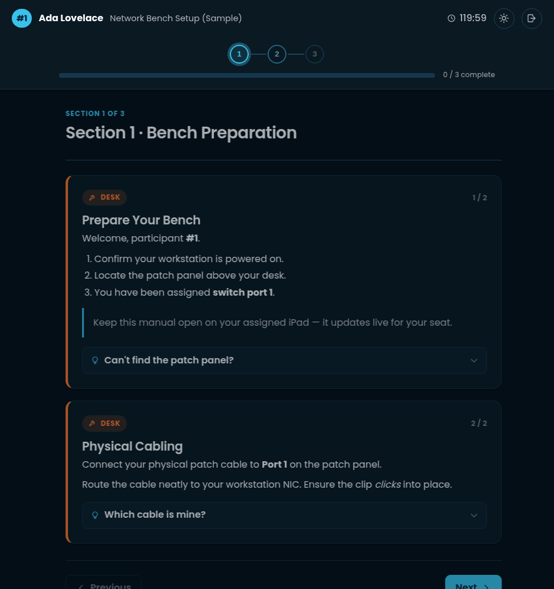
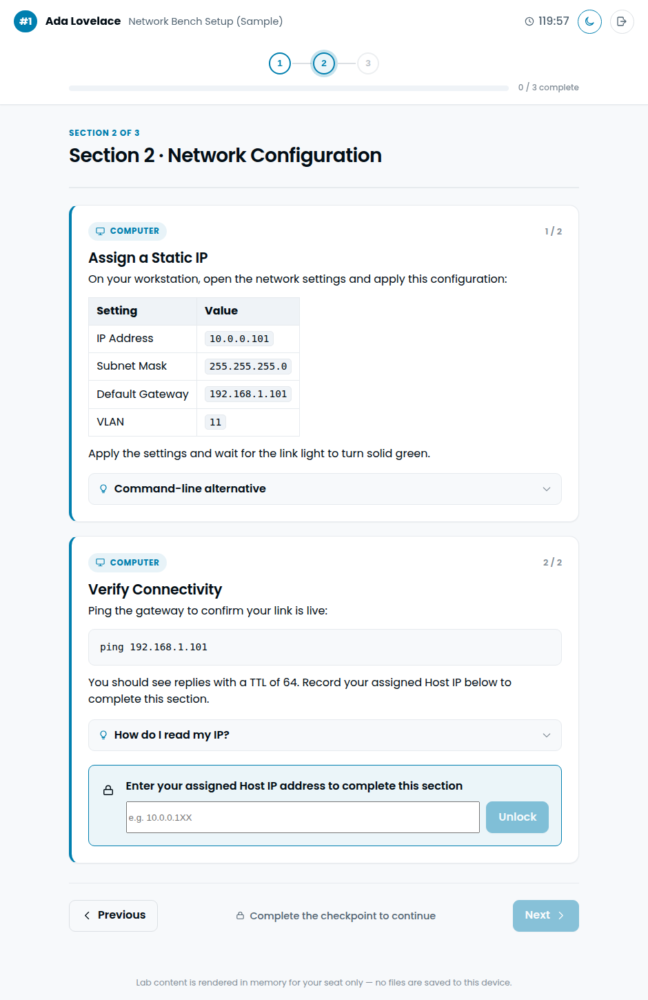
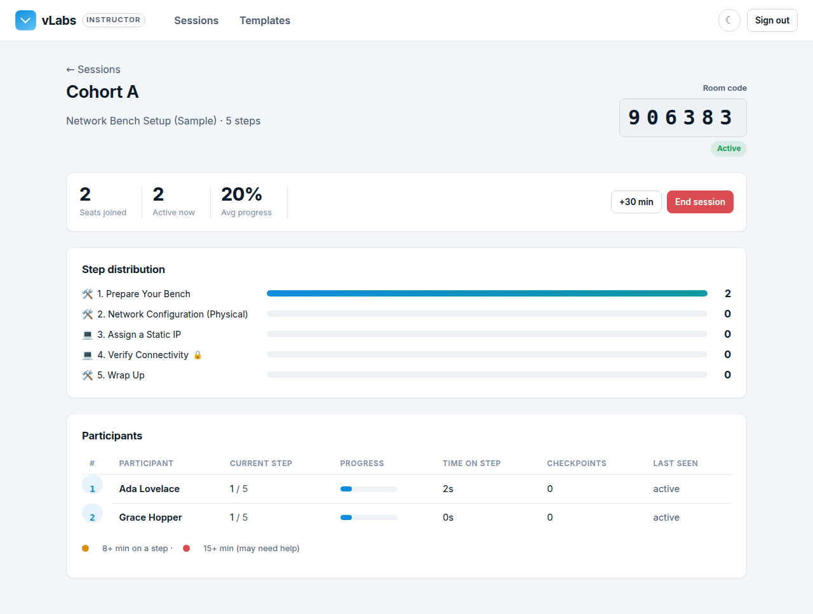
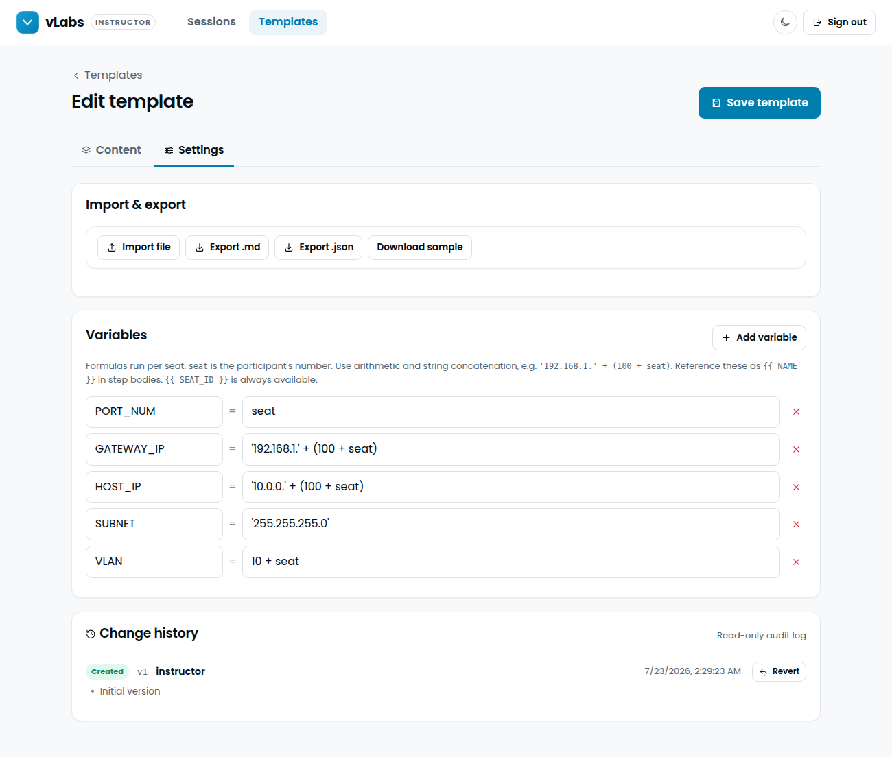

# vLabs — Dynamic Lab Manual Web Application

A secure, session-gated web application that replaces static, per-device PDF lab
manuals with a **dynamic templating engine** that personalises instructions for
every participant in real time.

Built to the _Dynamic Lab Manual Web Application_ technical specification:
eliminate physical PDF provisioning, enforce strict IP protection (no
downloadable materials), and deliver per-seat instructions live to classroom
devices.

Labs are organised into **sections** (each a page of steps) that participants
move through one at a time. The UI follows the Verkada brand system — a
white-led palette with a Blue 600 accent (off-black in dark mode), the Poppins
typeface, and a clean geometric line-icon set — with **full light & dark
modes**.

## Screenshots

| Participant lab — one section per page (dark)                  | Section with a checkpoint (light)                                     |
| -------------------------------------------------------------- | --------------------------------------------------------------------- |
|  |  |

| Instructor session monitor                               | Template authoring, import/export + live preview         |
| -------------------------------------------------------- | -------------------------------------------------------- |
|  |  |

Participant registration (the default landing page) is in
[`docs/screenshots/register.png`](docs/screenshots/register.png).

---

## Table of contents

- [Highlights](#highlights)
- [Architecture](#architecture)
- [Tech stack](#tech-stack)
- [Quick start (local dev on a Mac)](#quick-start-local-dev-on-a-mac)
- [Hosting a class (Raspberry Pi, bare metal + systemd)](#hosting-a-class-raspberry-pi-bare-metal--systemd)
- [How it works](#how-it-works)
  - [The templating engine](#the-templating-engine)
  - [Progressive disclosure & checkpoints](#progressive-disclosure--checkpoints)
  - [Sessions are snapshots](#sessions-are-snapshots)
  - [Registration, seat numbers & resume](#registration-seat-numbers--resume)
  - [Template lifecycle: versions, archive, delete](#template-lifecycle-versions-archive-delete)
  - [Template import / export](#template-import--export)
  - [Theming](#theming)
  - [Security & IP protection](#security--ip-protection)
- [Data model](#data-model)
- [API reference](#api-reference)
- [Configuration](#configuration)
- [Testing & CI](#testing--ci)
- [Deployment notes](#deployment-notes)
- [Upgrading an existing deployment](#upgrading-an-existing-deployment)
- [Project layout](#project-layout)

---

## Highlights

| Spec requirement                                                                                                                    | Where it lives                                                                                         |
| ----------------------------------------------------------------------------------------------------------------------------------- | ------------------------------------------------------------------------------------------------------ |
| **Instructor Portal** — create sessions, generate 6-digit codes, monitor, extend, push template updates & terminate                 | `client/src/pages/Dashboard.jsx`, `SessionMonitor.jsx`; `server/src/routes/sessions.js`                |
| **Participant registration** — first + last name, auto-assigned number (1–100) in join order                                        | `client/src/pages/Join.jsx`; `server/src/routes/participant.js`                                        |
| **Participant-first login** — registration is the default page; a small link goes to the instructor sign-in                         | `client/src/App.jsx`                                                                                   |
| **Dynamic templating** — one master template, `{{ PLACEHOLDERS }}` resolved per seat from sandboxed formulas                        | `server/src/lib/templating.js`                                                                         |
| **Sectioned manuals** — desk vs computer cards, hints, step solutions, checkpoints gating the next section                          | `server/src/lib/templating.js`, `client/src/pages/Lab.jsx`, `components/StepCard.jsx`                  |
| **Frozen-at-launch sessions** — a running class never changes under participants; instructor pushes updates explicitly              | `server/src/lib/sessionLifecycle.js`, `routes/sessions.js`                                             |
| **Template authoring** — in-page editor, live per-seat preview, Markdown/JSON import & export, immutable change history with revert | `client/src/pages/TemplateEditor.jsx`, `client/src/lib/templateFormat.js`, `shared/template-schema.js` |
| **Archive instead of delete** — templates archive by default; permanent deletion keeps session analytics and history                | `server/src/routes/templates.js`                                                                       |
| **IP protection** — content is JSON to the DOM only, `no-store`, no file endpoints, print-hidden                                    | `server/src/routes/participant.js`, `client/src/styles.additions.css`                                  |
| **Session gating & kill-switch** — every participant request re-validates the live session                                          | `server/src/middleware/auth.js`                                                                        |
| **Rate limiting & anti-scraping** — identity-keyed limiters, failed-join brute-force cap, progressive delivery                      | `server/src/middleware/rateLimit.js`                                                                   |
| **Live analytics** — per-seat section, time-on-section, hints, solutions, finished; section distribution                            | `server/src/routes/sessions.js`, `client/src/pages/SessionMonitor.jsx`                                 |
| **Instructor account** — password change with revocation of older tokens                                                            | `server/src/routes/auth.js`, `client/src/pages/Account.jsx`                                            |

## Architecture

```
┌────────────────────────┐      HTTPS (reverse proxy)      ┌──────────────────────────────┐
│  Browser (SPA)         │ ──────────────────────────────▶ │  Node 22 · Express            │
│  React 18 + Vite       │   /api/*  JSON, bearer tokens   │  helmet · cors · rate limits  │
│  participant or        │ ◀────────────────────────────── │  templating engine (sandboxed)│
│  instructor audience   │   no-store rendered content     │  better-sqlite3 (WAL)         │
└────────────────────────┘                                 └──────────────┬───────────────┘
                                                                          │
                                                          ┌───────────────▼──────────────┐
                                                          │ SQLite: instructors,         │
                                                          │ templates, template_audit,   │
                                                          │ sessions (own content copy), │
                                                          │ participants                 │
                                                          └──────────────────────────────┘
```

- In production the Express app serves the built SPA from `client/dist` and the
  API from `/api`, so everything is same-origin behind one TLS proxy.
- In development Vite serves the SPA on `:5173` and proxies `/api` to `:4000`.
- `shared/template-schema.js` is a dependency-free ESM module imported by both
  the server (validation) and the client (editor, import/export) so the template
  shape cannot drift between them.

## Tech stack

| Layer    | Choice                                                            | Why                                                                                    |
| -------- | ----------------------------------------------------------------- | -------------------------------------------------------------------------------------- |
| Backend  | Node 22, Express 4                                                | Small, well understood, runs anywhere Node does (a Pi included)                        |
| Database | SQLite via `better-sqlite3` (WAL)                                 | Single-box deployment; zero ops; synchronous API keeps handlers simple                 |
| Auth     | `jsonwebtoken` (HS256, separate secrets per audience), `bcryptjs` | Stateless tokens + live-session re-validation = instant revocation without a blocklist |
| Security | `helmet` (strict CSP), `express-rate-limit`, `cors`               | Spec's IP protection and anti-scraping requirements                                    |
| Frontend | React 18, React Router 6, Vite 6                                  | Fast SPA with code-split instructor portal                                             |
| Markdown | `marked` + `DOMPurify`                                            | Rich step bodies with defence-in-depth sanitisation                                    |
| Tests    | `node:test` (server + client libs)                                | No extra test dependencies                                                             |
| Tooling  | ESLint 9 (flat config), Prettier 3, GitHub Actions, Dependabot    |                                                                                        |

## Quick start (local dev on a Mac)

Requires **Node 22+** (`brew install node@22` or nvm). Everything runs on
loopback; nothing is reachable from your Wi-Fi.

```bash
npm run setup          # npm ci for the root tooling, server/ and client/
npm run dev            # API (node --watch, :4000) + Vite (:5173) in one terminal
```

Open **http://localhost:5173**. The API restarts on server changes, the SPA
hot-reloads on client changes, and Ctrl-C stops both. No `.env` is needed in
dev — the defaults boot as-is — but `cp .env.example .env` lets you override
anything (the file is always read from the repo root, whatever directory you
start from).

Default instructor credentials (created on first run only, override via env):

```
username: instructor
password: labmanual123
```

The portal shows a banner until this password is changed (**Account → Change
password**). In production the server refuses to _create_ the bootstrap account
with the default password at all.

Other root commands: `npm test`, `npm run lint`, `npm run format`,
`npm run build` (writes `client/dist/`), and `npm start` (serves the built SPA
from the API like the Pi does — useful to check a production build locally:
`NODE_ENV=production` plus the three secrets from `.env.example`).

Try it end-to-end:

1. Sign in to the instructor portal (small link on the registration page) →
   **Launch a session** from the seeded _Network Bench Setup_ template. A
   6-digit room code appears (click it to copy).
2. On the default registration page, enter the code and register with a first
   and last name. The server assigns the next number in join order (the first
   participant is `#1`).
3. The lab opens **section by section**, personalised for that number
   (participant `#1` → gateway `192.168.1.101`, host `10.0.0.101`, port `1`,
   cable tag `S01`…). Expand hints, and in section 2 clear the checkpoint
   (`10.0.0.101` or `10.0.0.101/24` — alternative answers are supported) to
   unlock the next section. Close the tab and reopen — a **Resume** banner
   brings you straight back to the same seat and section, or use **Exit** to
   leave.
4. Back in the instructor **session monitor**, watch each named participant's
   live section progress, time-on-section, total time and the session's time
   remaining; **End session** to revoke access instantly.
5. Edit the template while the session is running: nothing changes for
   participants until you click **Push latest version** on the monitor.
6. In **Templates**, edit sections in-page, import/export a `.md`/`.json`,
   archive a template, and toggle **light / dark mode** from the ☾/☀ control on
   any screen.

## Hosting a class (Raspberry Pi, bare metal + systemd)

The production target is a Raspberry Pi 4/5 (64-bit OS) on the classroom
network: Node runs as a hardened systemd service on `127.0.0.1:4000`, and
**Caddy** terminates HTTPS on `:443` with its built-in CA. One script does the
whole install:

```bash
sudo apt install -y git
sudo git clone https://github.com/not-mehul/vLabs.git /opt/vlabs
sudo /opt/vlabs/deploy/pi/install.sh        # asks for a hostname, generates secrets
```

Participants then open **https://vlabs.local** (after installing the root
certificate once from `http://vlabs.local/vlabs-root.crt`). Updating is
`sudo /opt/vlabs/deploy/pi/update.sh`. The full runbook — network choices,
certificate installation per device type, backups, troubleshooting — is in
[DEPLOYMENT.md](DEPLOYMENT.md).

## How it works

### The templating engine

Instead of maintaining 20 separate manuals, one **master template** is stored as
structured JSON sections/steps containing mustache-style placeholders. Variables
are resolved **per seat** at render time.

Instructors author variable **formulas** (not code). For example:

| Variable     | Expression                    | Seat 7 →        |
| ------------ | ----------------------------- | --------------- |
| `PORT_NUM`   | `seat`                        | `7`             |
| `SEAT_TAG`   | `'S' + pad(seat, 2)`          | `S07`           |
| `GATEWAY_IP` | `'192.168.1.' + (100 + seat)` | `192.168.1.107` |
| `HOST_IP`    | `'10.0.0.' + (100 + seat)`    | `10.0.0.107`    |
| `MAC_SUFFIX` | `pad(hex(seat), 2)`           | `07`            |

Formulas are evaluated by a **hand-written recursive-descent evaluator** — never
`eval()`/`Function()`. It understands numbers, quoted strings, `+ - * / %`,
parentheses, the built-ins `seat`, `first_name` and `last_name`, previously
defined variables (so formulas can compose), and a small whitelist of pure
helpers: `pad`, `hex`, `floor`, `ceil`, `round`, `abs`, `mod`, `min`, `max`,
`upper`, `lower`, `str`, `slug`, `initials`. Anything else — unknown
identifiers, prototype names, `constructor(...)`, semicolons — is rejected.
Expressions are capped in length and nesting depth, and division by zero is an
error.

Participant names are first-class: `{{ FIRST_NAME }}`, `{{ LAST_NAME }}` and
`{{ FULL_NAME }}` are always available, and formulas can derive from them —
`USERNAME = slug(first_name) + '.' + slug(last_name)` gives `mary.oneil`,
`initials(first_name + ' ' + last_name)` gives `MO`.

Placeholders are written `{{ NAME }}` in section titles, step titles, bodies,
hints, solutions and checkpoint prompts/answers. `{{ SEAT_ID }}` is always
available. **Saving a template that references an undeclared placeholder is
refused** with the exact location (`Unknown placeholder {{ HOST_IPP }} in
Section 2 · step 2 checkpoint answer`), and the editor flags it live while you
type — a typo in a checkpoint answer used to silently produce an unpassable
checkpoint.

### Step types

| Type       | Card                   | Can carry                   | Use for                                           |
| ---------- | ---------------------- | --------------------------- | ------------------------------------------------- |
| `desk`     | Hands-On (orange)      | hints, solution, checkpoint | physical bench work                               |
| `computer` | Workstation (blue)     | hints, solution, checkpoint | work on the machine                               |
| `info`     | Read (neutral, dashed) | body only                   | context, background, safety notes — nothing to do |

Info steps never block progress and are stripped of any hint/solution/
checkpoint on save, so switching a step's type in the editor is always safe.

### Progressive disclosure & checkpoints

Content is delivered **progressively**. A participant only ever receives the
sections they have unlocked, and within the furthest section only the steps up
to the first uncompleted checkpoint:

- **Sections** gate on checkpoints: section _n_ is reachable only once every
  checkpoint in sections _0 … n−1_ is cleared.
- **Steps** within a section reveal up to and including the first open
  checkpoint; clearing it reveals the rest.
- **Checkpoint answers never leave the server.** The participant submits a value
  and the server compares it (whitespace/case-insensitively) against the
  seat-specific primary answer and any authored **alternative answers**.
- **Pattern checkpoints** cover values the author _cannot_ know in advance — a
  device serial, a MAC address, a ticket number. Instead of an answer the
  checkpoint carries a **mask**: `9` digit, `A`/`a` letter (stored upper/lower
  case), `X`/`x` letter or digit, `?` any character, `*` anything; other
  letters and digits must match literally, and punctuation or spaces are
  **optional separators**. So `XXXX.XXXX.XXXX` accepts `abcd1234wxyz` and
  `ABCD.1234.WXYZ` alike (not `abcd-1234-wxyz`), and canonicalises both to
  `ABCD.1234.WXYZ`. The mask, like an answer, never ships to the browser; the
  participant only sees the prompt and an example placeholder.
- **Captured values.** Any checkpoint may **save the accepted value as a
  variable** (`capture: SERIAL`). From the _next_ step onward the canonical
  value is available as `{{ SERIAL }}` in bodies, hints, solutions, prompts and
  even exact answers of later checkpoints, so a lab can say _"label the switch
  ABCD.1234.WXYZ"_ or verify the participant re-enters the same serial later.
  Referencing a capture before its checkpoint is a save-time error. Captured
  values appear per seat on the session monitor and as columns in the CSV/JSON
  export.
- **Hints** are collapsible; opening one is recorded (analytics). A step's
  optional **solution** (Markdown) can be revealed only after _every_ hint on
  that step has been opened — and it is only sent to the browser at that moment.
- Hints, solutions, checkpoints and progress reports all go through the **same
  reachability gate**: a seat cannot act on a step it cannot yet see.

### Sessions are snapshots

Launching a session **copies the template** (title, content, variables and
version number) into the session row. Participants are rendered from that copy,
so:

- Editing the master template mid-class never shifts step or checkpoint indices
  under participants.
- The session monitor shows _"Template v3 is available — this session is
  running v2"_ with a **Push latest version** button. Pushing copies the new
  version into the session; participants' status poll notices the version
  change and reloads the manual within ~15 s. Cleared checkpoints are
  re-evaluated against the new structure (the UI warns that reordering can move
  people forwards or backwards), and section pointers are clamped to the new
  length.
- Exports and analytics of ended sessions keep working even if the template is
  later archived or permanently deleted.

Sessions that pass `expires_at` without being terminated are swept to _ended_
after a grace window (`EXPIRED_SESSION_GRACE_MINUTES`, default 60) so their room
codes recycle; the grace keeps "+30 min" working on a session that just ran
out.

### Registration, seat numbers & resume

1. **Named registration** — participants enter a room code plus first and last
   name. The server assigns the next ascending seat number in join order (max
   100 per session); that number is what formulas see as `seat`.
2. **Idempotent rejoin** — registering again with the same name (case- and
   whitespace-insensitive) in the same session returns the _same_ number and
   progress, even from a different device or after clearing storage.
3. **Resume** — the participant token (never any content) is stored in
   `localStorage`; the registration page validates it with the lightweight
   `/status` probe and offers a _Resume_ banner while the session is live.

### Template lifecycle: versions, archive, delete

- Every save bumps `version` and appends an immutable **audit** entry with a
  full snapshot (append-only is enforced by database triggers). The editor's
  _Change history_ summarises each version and can **revert** (loads the old
  snapshot for review; saving creates a new version).
- **Archive** (the default "delete") hides a template from the list and the
  session launcher. Archived templates remain readable/editable and can be
  **restored**. Launching a session from an archived template is refused.
- **Permanent deletion** is available on archived templates, behind a warning
  and a typed confirmation, and refused while a session launched from it is
  still active. Sessions keep their own copy (`template_id` becomes `NULL`);
  the audit history, including a final snapshot, survives.
- Templates are a **shared workspace** — any instructor can edit any template.
  Sessions belong to the instructor who launched them.

### Template import / export

Templates can be authored entirely in the browser or imported from a file:

- **Export** as **JSON** (canonical form) or **Markdown** (human-friendly).
- **Import** a `.json` or `.md` file to populate the editor; **Download sample**
  grabs a ready-to-edit example.
- The Markdown convention (documented in `client/src/lib/templateFormat.js`)
  uses frontmatter for `title`/`description`/`variables`, `#` for sections,
  `## [desk|computer|info]` for steps, and `> hint:` / `> solution:` /
  `> checkpoint:` / `> pattern:` / `> capture:` / `> placeholder:` directives.
  Fenced code blocks are copied verbatim (a `#` inside one is not a heading),
  hints may span multiple quoted lines, `\::` and `\|` escape the separators,
  and checkpoint answers may list alternatives separated by `|`. A
  `> checkpoint: prompt` line without an `:: answer` part followed by
  `> pattern: XXXX.XXXX.XXXX` is a pattern checkpoint; `> capture: SERIAL`
  saves the accepted value for later steps. **Round-trips are lossless**
  (covered by `client/tests/templateFormat.test.js`).

### Theming

A `ThemeContext` provides **light and dark modes** built on CSS custom
properties toggled on `<html data-theme>`. The initial theme follows the OS
`prefers-color-scheme`; the user's manual choice is persisted to `localStorage`
and a toggle is available on every screen. Colours follow the Verkada palette
(white / neutral grays led by Blue 600 `#007faf`; off-black `#030e16` with a
brighter Blue 400 accent in dark mode), the self-hosted **Poppins** typeface
(CSP-safe, no external requests), and an original set of geometric line icons
(`components/Icon.jsx`). The vLabs mark is our own — the Verkada logo/symbol is
never reproduced.

### Security & IP protection

| Requirement                       | Implementation                                                                                                                                                                                                                                                                                                                                                                                                                                                                             |
| --------------------------------- | ------------------------------------------------------------------------------------------------------------------------------------------------------------------------------------------------------------------------------------------------------------------------------------------------------------------------------------------------------------------------------------------------------------------------------------------------------------------------------------------ |
| **IP protection**                 | Lab content is delivered as JSON to the DOM only. No PDF/DOCX/file endpoints exist; rendered content is served with `Cache-Control: no-store`; the lab view is hidden when printing (a deterrent, not a control). Only an access token is persisted for resume — never content.                                                                                                                                                                                                            |
| **Session gating**                | Access requires a time-limited 6-digit code. Every participant request re-validates the live session (`is_active` + `expires_at`) and the seat, so a token is rejected the instant an instructor terminates the session or it expires — no token blocklist needed.                                                                                                                                                                                                                         |
| **Progressive delivery**          | A seat can only pull sections/steps it has legitimately reached, which caps what any single seat (or scraper) can extract.                                                                                                                                                                                                                                                                                                                                                                 |
| **Anti-scraping / rate limiting** | Layered `express-rate-limit`. Authenticated limits are keyed on the **verified identity inside the token** (participant/instructor id), not the raw header — so a classroom behind one NAT is not throttled as one client, garbage tokens cannot mint fresh buckets, and re-joining cannot reset a seat's checkpoint-guessing or content limits. Anonymous joins are capped per IP on _failed_ attempts (code enumeration) and, more generously, on total attempts (token-minting floods). |
| **Formula sandbox**               | Instructor formulas run in a purpose-built evaluator with a fixed function whitelist, no property access, and length/depth caps.                                                                                                                                                                                                                                                                                                                                                           |
| **Authored content**              | Templates are validated and size-capped server-side; Markdown is rendered through `marked` and sanitised with DOMPurify (inline `style` and form elements stripped).                                                                                                                                                                                                                                                                                                                       |
| **Transport & headers**           | Designed to run behind mandatory HTTPS/TLS (reverse proxy). Strict `helmet` CSP with **no `unsafe-inline`**, `frame-ancestors 'none'`, `no-referrer`, `noindex`. `TRUST_PROXY` must match the topology.                                                                                                                                                                                                                                                                                    |
| **Credentials**                   | Instructor passwords hashed with bcrypt (constant-time compare with a dummy hash for unknown users); separate HS256 secrets per token audience; instructor tokens carry a `token_version` so **changing the password revokes every older token**.                                                                                                                                                                                                                                          |
| **Fail-fast configuration**       | In production the server refuses to start with weak/placeholder JWT secrets, identical secrets, or when it would create the bootstrap instructor with the default password.                                                                                                                                                                                                                                                                                                                |
| **Operational**                   | Structured request/audit logging (no bodies or tokens), DB-backed health check, graceful shutdown that closes SQLite cleanly.                                                                                                                                                                                                                                                                                                                                                              |

Known trade-off (by design): seat **rejoin is name-only** for classroom
simplicity, so a participant who knows a classmate's name in a live session
could take over their seat. If that matters for your environment, run kiosk
devices and keep room codes private.

## Data model

SQLite tables (`server/src/db/index.js`), migrated with `PRAGMA user_version`
(current version **2**):

- **`instructors`** — `id`, `username`, `password_hash`, `token_version`
  (bumped on password change; embedded in JWTs), `password_changed_at`.
- **`templates`** — `id`, `title`, `description`, `content` (JSON sections →
  steps), `variables` (JSON formulas), `version`, `archived_at`, `created_by`,
  timestamps.
- **`template_audit`** — append-only history: `template_id`, `template_title`,
  `action` (`created | updated | archived | restored | deleted`), `version`,
  `snapshot` (full JSON), `instructor_id`, `instructor_username`, `at`.
  `UPDATE`/`DELETE` are rejected by triggers.
- **`sessions`** — `id`, `room_code`, `title`, `template_id` (nullable,
  `ON DELETE SET NULL`), `instructor_id`, **`template_version`,
  `template_title`, `content`, `variables`** (the session's own snapshot),
  `is_active`, `expires_at`, `created_at`, `ended_at`. A partial unique index
  keeps room codes unique among _active_ sessions only.
- **`participants`** — `id`, `session_id`, `seat_number` (1–100),
  `first_name`, `last_name`, `name_key`, `current_section`, `max_section`,
  `completed_checkpoints` (JSON `"section.step"` keys), `captured_values`
  (JSON `{ NAME: "canonical value" }` from pattern/capturing checkpoints),
  `hints_taken`, `revealed_solutions`, `finished_at`, `section_entered_at`,
  `joined_at`, `last_seen_at`. Unique on `(session_id, seat_number)` and
  `(session_id, name_key)`.

Step storage shape (per section `steps[]`):

```json
{
  "type": "desk | computer",
  "title": "…",
  "body": "markdown with {{ VARS }}",
  "hints": [{ "label": "…", "text": "markdown" }],
  "solution": "markdown (optional)",
  "checkpoint": {
    "prompt": "…",
    "placeholder": "…",
    "answer": "{{ HOST_IP }}",
    "answers": ["{{ HOST_IP }}/24"]
  }
}
```

## API reference

All routes are under `/api`. Errors are `{ error, code?, details? }`.

### Public

| Method | Path                | Description                                                                         |
| ------ | ------------------- | ----------------------------------------------------------------------------------- |
| `GET`  | `/health`           | Liveness; runs a DB query, `503` if it fails                                        |
| `POST` | `/auth/login`       | `{ username, password }` → `{ token, instructor }` (`must_change_password` flag)    |
| `POST` | `/participant/join` | `{ room_code, first_name, last_name }` → `{ token, resumed, seat_number, session }` |

### Instructor (Bearer instructor token)

| Method   | Path                          | Description                                                                                                                                  |
| -------- | ----------------------------- | -------------------------------------------------------------------------------------------------------------------------------------------- |
| `GET`    | `/auth/me`                    | Current instructor                                                                                                                           |
| `PUT`    | `/auth/password`              | `{ current_password, new_password }` → fresh token; revokes older tokens                                                                     |
| `GET`    | `/templates`                  | List (add `?include_archived=1`); includes `session_count`, `active_session_count`, `archived_at`                                            |
| `GET`    | `/templates/functions`        | Formula helper names                                                                                                                         |
| `POST`   | `/templates`                  | Create (validated; `400` with `details[]`)                                                                                                   |
| `GET`    | `/templates/:id`              | Full template                                                                                                                                |
| `PUT`    | `/templates/:id`              | Update → new version; running sessions unaffected                                                                                            |
| `DELETE` | `/templates/:id`              | **Archive** (`204`)                                                                                                                          |
| `DELETE` | `/templates/:id?permanent=1`  | Permanently delete; `409` while sessions are active                                                                                          |
| `POST`   | `/templates/:id/restore`      | Un-archive                                                                                                                                   |
| `GET`    | `/templates/:id/audit`        | Change history (newest first)                                                                                                                |
| `POST`   | `/templates/:id/preview`      | `{ seat_id, first_name?, last_name?, draft? }` → rendered manual for one seat (solutions inline; captures stood in by mask examples)         |
| `GET`    | `/sessions`                   | This instructor's sessions with `participant_count`, `template_version`, `update_available`                                                  |
| `POST`   | `/sessions`                   | `{ template_id, title?, duration_minutes? }` → session (snapshot taken; `409` if template archived)                                          |
| `GET`    | `/sessions/:id`               | Detail + live analytics (`section_distribution`, `participants[]` incl. `captured`, `capture_names`, `template_exists`, `template_archived`) |
| `POST`   | `/sessions/:id/terminate`     | End now; participant tokens rejected immediately                                                                                             |
| `POST`   | `/sessions/:id/extend`        | `{ minutes }` added to the later of now / current expiry                                                                                     |
| `POST`   | `/sessions/:id/push-template` | Copy the template's latest version into the live session                                                                                     |
| `DELETE` | `/sessions/:id`               | Delete session and its participants                                                                                                          |
| `GET`    | `/sessions/:id/export`        | JSON export incl. per-participant `captured` values (works after template deletion)                                                          |

### Participant (Bearer participant token; every call re-validates the session)

| Method | Path                      | Description                                                                                                                                               |
| ------ | ------------------------- | --------------------------------------------------------------------------------------------------------------------------------------------------------- |
| `GET`  | `/participant/content`    | Unlocked sections rendered for the seat (checkpoints carry `mode`, never answers/masks); `template_version`                                               |
| `GET`  | `/participant/status`     | Heartbeat: `expires_at`, `finished`, `template_version`                                                                                                   |
| `POST` | `/participant/checkpoint` | `{ section_index, step_index, answer }` → `{ correct, section_cleared?, unlocked_section? }`; stores the canonical value when the checkpoint captures one |
| `POST` | `/participant/progress`   | `{ section_index }` — section being viewed                                                                                                                |
| `POST` | `/participant/hint`       | `{ section_index, step_index, hint_index }`                                                                                                               |
| `POST` | `/participant/solution`   | `{ section_index, step_index }` → `{ solution }` once all hints are open                                                                                  |
| `POST` | `/participant/finish`     | Mark the lab complete                                                                                                                                     |

Participant error codes: `SESSION_ENDED`, `SESSION_EXPIRED`, `SEAT_REMOVED`.
Instructor: `TOKEN_REVOKED`.

Rate limits (per minute unless noted): API 300 per identity/IP; join 20 failed
per IP / 5 min and 300 total per IP / 5 min; login 10 failed per IP / 15 min;
per seat: checkpoint 30, content/status/solution 120, other actions 120.

## Configuration

Copy `.env.example` → `.env` at the repo root (the server reads that file from
wherever it is started; real environment variables win). On the Pi the same
variables live in `/etc/vlabs/vlabs.env`, generated by `deploy/pi/install.sh`
and loaded by systemd. Everything has a dev default so the app boots with no
config; **production refuses to start** when secrets are weak/placeholder,
identical, or when it would create the bootstrap instructor with the default
password.

| Variable                                                | Default                         | Purpose                                                                                                               |
| ------------------------------------------------------- | ------------------------------- | --------------------------------------------------------------------------------------------------------------------- |
| `NODE_ENV`                                              | `development`                   | `production` enables the guard rails and JSON logs; the Pi unit forces it                                             |
| `HOST`                                                  | `127.0.0.1`                     | Bind address. Loopback in dev (Vite proxies) and on the Pi (Caddy proxies); `0.0.0.0` only to expose Node itself      |
| `PORT`                                                  | `4000`                          | API / server port                                                                                                     |
| `DB_PATH`                                               | `server/data/vlabs.sqlite`      | SQLite file location (`/var/lib/vlabs/vlabs.sqlite` on the Pi)                                                        |
| `JWT_INSTRUCTOR_SECRET`                                 | dev value                       | Instructor token key (≥ 32 chars in production)                                                                       |
| `JWT_PARTICIPANT_SECRET`                                | dev value                       | Participant token key (must differ from the above)                                                                    |
| `JWT_INSTRUCTOR_TTL` / `JWT_PARTICIPANT_TTL`            | `12h`                           | Token lifetimes                                                                                                       |
| `SEED_INSTRUCTOR_USERNAME` / `SEED_INSTRUCTOR_PASSWORD` | `instructor` / `labmanual123`   | Bootstrap instructor (first run only)                                                                                 |
| `MIN_PASSWORD_LENGTH`                                   | `10`                            | Policy for the change-password endpoint                                                                               |
| `TRUST_PROXY`                                           | unset (`false`)                 | Express `trust proxy`: `1` behind Caddy on the Pi, `true`, a hop count, or CIDR list                                  |
| `SERVE_PLAIN_HTTP`                                      | `false`                         | Only for TLS-less `http://` access: drops HSTS + `upgrade-insecure-requests`. Not needed on the Pi (Caddy does HTTPS) |
| `CORS_ORIGINS`                                          | `http://localhost:5173`         | Allowed origins (empty in prod, same-origin)                                                                          |
| `LOG_LEVEL`                                             | `info` (`silent` in tests)      | `debug                                                                                                                | info | warn | error | silent` |
| `LOG_FORMAT`                                            | `pretty` (`json` in production) | Log line format                                                                                                       |
| `EXPIRED_SESSION_GRACE_MINUTES`                         | `60`                            | Expired sessions auto-end after this, freeing their room code                                                         |

## Testing & CI

```bash
npm test                # from the repo root: server + client suites
cd server && npm test   # unit + HTTP integration tests (node:test, no extra deps)
cd client && npm test   # template format unit tests (node:test)
npm run lint            # ESLint across server, client and shared
npm run format          # Prettier write (repo root); format:check runs in CI
```

Suites, all under Node's built-in test runner:

- **`server/tests/templating.test.js`** — the security-critical templating
  core: precedence, concatenation, the Seat 7 → `.107` example, composition,
  helper functions, sandbox rejections (unknown/prototype identifiers, unknown
  functions, division by zero, depth/length caps), placeholder injection,
  answer/solution stripping, multi-answer matching, reachability gating,
  validator rules (unknown placeholders, duplicate/reserved variables, caps).
- **`server/tests/api.test.js`** — boots the real Express app on an ephemeral
  port against an isolated temp DB: auth gating and audience checks, rejoin
  idempotency, progressive delivery, hint/progress gating, solution gating,
  checkpoint validation incl. alternatives, validation error details, template
  archive/restore/permanent delete (sessions detach intact), frozen snapshot +
  push, the 101st-participant limit, password change revoking older tokens,
  the kill-switch, audit immutability and the schema version.
- **`server/tests/time.test.js`** — UTC parsing of SQLite and ISO timestamps.
- **`client/tests/templateFormat.test.js`** — lossless Markdown/JSON
  round-trips, code-fence handling, multi-line hints, escapes, alternatives,
  and the bundled sample.

`.github/workflows/ci.yml` runs lint + format check, both test suites with
`npm audit`, a client production build, and a bare-metal production smoke test
(production deps only, `NODE_ENV=production`, real secrets, `/api/health` and
the served SPA) that mirrors what `deploy/pi/install.sh` does on the Pi, plus a
`systemd-analyze verify` of the unit files. Dependabot keeps npm and Actions
current.

## Deployment notes

Two supported ways to run the app, both from the same tree:

|               | Mac (dev)                             | Raspberry Pi (hosting a class)                                                             |
| ------------- | ------------------------------------- | ------------------------------------------------------------------------------------------ |
| Start         | `npm run dev`                         | `systemctl start vlabs` (installed by `deploy/pi/install.sh`)                              |
| SPA served by | Vite on `:5173` (HMR, proxies `/api`) | Node from `client/dist`                                                                    |
| TLS           | none (loopback only)                  | Caddy on `:443`, internal CA (`deploy/pi/Caddyfile.template`)                              |
| Node binds    | `127.0.0.1:4000`                      | `127.0.0.1:4000`, `TRUST_PROXY=1`                                                          |
| Config        | `.env` at the repo root (optional)    | `/etc/vlabs/vlabs.env` (generated, 0640)                                                   |
| Database      | `server/data/vlabs.sqlite`            | `/var/lib/vlabs/vlabs.sqlite` + nightly `vlabs-backup.timer`                               |
| Logs          | terminal, pretty                      | `journalctl -u vlabs`, Caddy access log                                                    |
| Update        | `git pull`                            | `sudo deploy/pi/update.sh` (backup → pull → build → restart → health check, auto-rollback) |

Per the spec's deployment section:

1. **HTTPS/TLS is mandatory.** On the Pi, Caddy terminates TLS with its internal
   CA and `TRUST_PROXY=1` keeps client IPs (and per-IP limits) correct. Devices
   trust the root certificate once (`deploy/pi/export-root-cert.sh` publishes
   it at `http://vlabs.local/vlabs-root.crt`). Any other reverse proxy works the
   same way — set `TRUST_PROXY` to the number of hops.
2. **Single box, SQLite.** State lives in `/var/lib/vlabs`; `vlabs-backup.timer`
   takes a consistent snapshot nightly, and `update.sh` takes one before every
   upgrade. Set `BACKUP_DIR` in `/etc/vlabs/vlabs.env` to copy snapshots off
   the SD card.
3. **Kiosk-mode iPads.** Provision classroom iPads with an MDM / Apple
   Configurator to lock Safari to Single App Mode pointing at
   `https://vlabs.local`, hiding the URL bar, tabs and sharing. Because resume
   uses `localStorage`, shared devices should be reset between cohorts (or use
   **Exit** at the end of a lab).
4. **First run:** `install.sh` generates `SEED_INSTRUCTOR_PASSWORD` (printed
   once and kept in `/etc/vlabs/vlabs.env`); sign in, then change it from
   **Account**. The env var is unused after the account exists. More
   instructors: `sudo deploy/pi/vlabs-cli.sh instructors create <name>`.
5. **Logs** go to the journal, one line per API request plus lifecycle/audit
   events (`LOG_FORMAT=pretty` on the Pi for humans, `json` if you ship them).

## Upgrading an existing deployment

- The database migrates automatically on first boot (`user_version` 0/1 → 3).
  Migration 2 **rebuilds the `sessions` table** to make `template_id` nullable
  and to add the per-session content snapshot; existing sessions are
  back-filled from the audit snapshot matching their `template_version` (or
  the live template if none). Migration 3 adds `participants.captured_values`
  (additive). **Back up the database first** (`update.sh` does).
- Production **requires** `JWT_INSTRUCTOR_SECRET`, `JWT_PARTICIPANT_SECRET` and
  `SEED_INSTRUCTOR_PASSWORD`. Secrets that are short or look like placeholders
  (`change-me…`, `dev-…`) are rejected.
- Coming from the earlier Docker deployment? Copy `vlabs.sqlite` out of the
  `vlabs-data` volume to `/var/lib/vlabs/vlabs.sqlite` (owner `vlabs:vlabs`)
  before the first `systemctl start vlabs`; the Docker files themselves were
  removed in 1.2.0.
- Instructor tokens issued before the upgrade remain valid until that
  instructor changes their password.
- `DELETE /api/templates/:id` now archives; pass `?permanent=1` to delete.

## Project layout

```
vLabs/
├── package.json               # root scripts: setup, dev, build, start, test, lint, format
├── scripts/dev.js             # `npm run dev`: API + Vite side by side (no deps)
├── .env.example               # dev config; the Pi uses /etc/vlabs/vlabs.env
├── deploy/pi/                 # Raspberry Pi: install.sh, update.sh, backup.sh,
│                              #   vlabs-cli.sh, export-root-cert.sh, systemd units,
│                              #   Caddyfile.template (HTTPS, internal CA)
├── DEPLOYMENT.md              # Pi runbook + later hosted deployment
├── .github/                   # CI workflow + Dependabot
├── shared/
│   └── template-schema.js     # canonical template shape, limits, placeholder checks
├── server/                    # Express + SQLite API
│   ├── src/
│   │   ├── app.js             # express app (helmet, cors, logging, static SPA)
│   │   ├── index.js           # entrypoint: prod guards, sweeps, graceful shutdown
│   │   ├── config.js
│   │   ├── db/                # schema + versioned migrations, seeder (sample lab)
│   │   ├── lib/               # templating engine, validation, tokens, logger,
│   │   │                      #   session lifecycle, time
│   │   ├── middleware/        # auth (session gating), rate limits, errors
│   │   └── routes/            # auth, templates, sessions, participant
│   └── tests/                 # templating unit tests + HTTP integration tests
└── client/                    # React + Vite SPA
    ├── tests/                 # template format unit tests (node:test)
    └── src/
        ├── pages/             # Join (default), Lab, Dashboard, Templates,
        │                      #   TemplateEditor, SessionMonitor, InstructorLogin, Account
        ├── components/        # StepCard, HintBox, SolutionBox, Checkpoint, Markdown,
        │                      #   PortalShell, ThemeToggle, Icon (line-icon set)
        ├── hooks/             # instructor API helper, countdown
        ├── context/           # AuthContext, ThemeContext (light/dark)
        ├── lib/               # templateFormat (JSON/Markdown), files, format, datetime
        ├── styles.css         # design system + light & dark themes
        ├── styles.additions.css
        └── api.js             # fetch client (+ participant resume storage)
```
